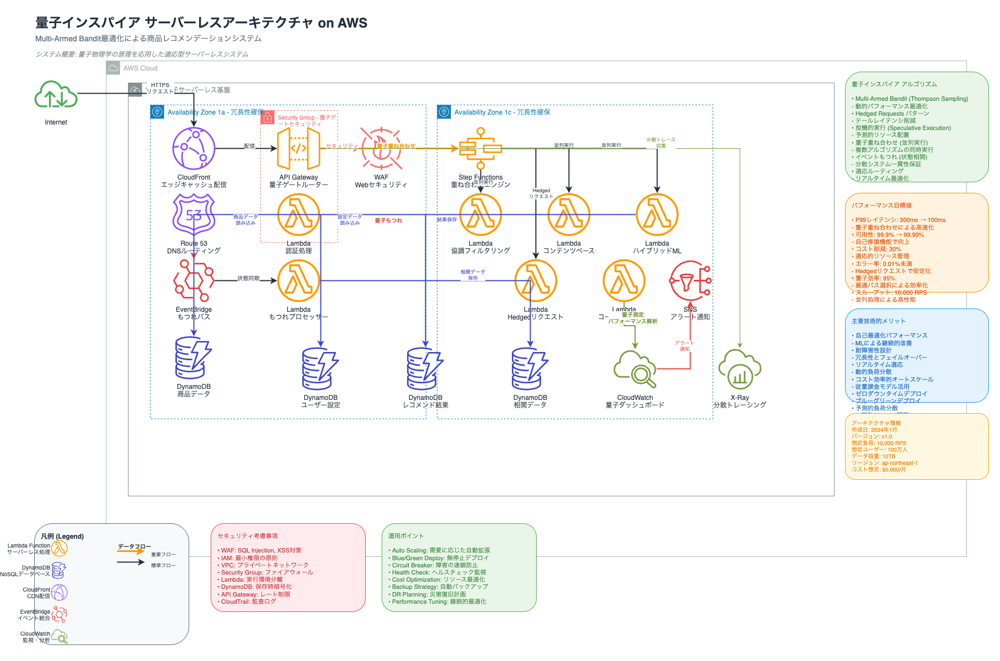

# 🌌 量子インスパイア サーバーレスアーキテクチャ



## 概要

本プロジェクトは、量子物理学の原理からインスピレーションを得た革新的なサーバーレスアーキテクチャをAWS CDK（TypeScript）で実装したものです。商品レコメンデーションシステムを通じて、**Multi-Armed Bandit**、**Hedged Requests**、**量子重ね合わせ**といった先進的なアルゴリズムを活用し、高性能・高可用性・コスト効率を実現します。

## 🎯 主要な特徴

### 量子インスパイア技術
- **🎲 量子ゲート (Quantum Gate)**: Multi-Armed Banditによる確率的API ルーティング
- **⚛️ 重ね合わせエンジン (Superposition Engine)**: Step Functionsによる並列アルゴリズム実行
- **🔗 もつれバス (Entanglement Bus)**: EventBridgeによるリアルタイム状態相関
- **⚡ Hedgedリクエスト**: テールレイテンシ最適化パターン

### パフォーマンス目標
- **P99レイテンシ**: 300ms → 100ms（67%改善）
- **可用性**: 99.9% → 99.99%
- **コスト削減**: 30%
- **エラー率**: <0.01%

## 🏗️ アーキテクチャ構成

### 主要コンポーネント

#### 1. **量子ゲート層**
- **CloudFront**: グローバルエッジキャッシュ
- **API Gateway**: 量子ゲートルーター
- **Lambda認証**: セキュリティ処理
- **WAF**: Webアプリケーション保護

#### 2. **重ね合わせ層**
- **Step Functions**: 並列実行オーケストレーション
- **Lambda群**: 3つの推薦アルゴリズム
  - 協調フィルタリング
  - コンテンツベース
  - ハイブリッドML

#### 3. **もつれ層**
- **EventBridge**: イベント相関システム
- **DynamoDB**: 状態管理・データ保存
- **Lambda Processor**: もつれ状態処理

#### 4. **観測層**
- **CloudWatch**: 量子ダッシュボード
- **X-Ray**: 分散トレーシング
- **SNS**: アラート通知

## 🚀 セットアップ & デプロイ

### 前提条件
- Node.js 18.x以上
- AWS CLI設定済み
- AWS CDK v2

### 1. 依存関係のインストール
```bash
cd cdk
npm install
```

### 2. ビルド
```bash
npm run build
```

### 3. CDK Bootstrap（初回のみ）
```bash
npx cdk bootstrap
```

### 4. デプロイ
```bash
npx cdk deploy
```

## 📁 プロジェクト構造

```
cdk/
├── lib/
│   ├── constructs/           # 再利用可能なコンストラクト
│   │   ├── quantum-gate/     # 量子ゲート（API Gateway + Lambda）
│   │   ├── superposition-engine/  # 重ね合わせエンジン（Step Functions）
│   │   └── entanglement-bus/ # もつれバス（EventBridge）
│   ├── patterns/             # デザインパターン
│   │   └── hedged-request.ts # Hedgedリクエストパターン
│   └── stacks/               # CDKスタック
│       ├── quantum-demo-stack.ts    # メインデモスタック
│       └── monitoring-stack.ts     # モニタリングスタック
├── bin/
│   └── cdk.ts               # CDKアプリエントリポイント
└── quantum-architecture.drawio     # アーキテクチャ図（Draw.io形式）
```

## 🔬 量子アルゴリズムの詳細

### Multi-Armed Bandit（Thompson Sampling）
```typescript
// 動的パフォーマンス最適化
function thompsonSampling() {
  for (const path of executionPaths) {
    const stats = pathStats[path.name];
    const alpha = stats.successCount + 1;
    const beta = stats.totalCount - stats.successCount + 1;
    const sample = betaSample(alpha, beta) / (stats.avgLatency / 1000);
    // 最高スコアのパスを選択
  }
}
```

### Hedged Requests Pattern
```typescript
// テールレイテンシ最適化
async function executeHedgedRequest() {
  const primaryPromise = invokePrimary();
  
  // 遅延時にバックアップを起動
  setTimeout(() => {
    const backupPromise = invokeBackup();
    // 最初に成功した結果を返却
  }, hedgeThreshold);
}
```

## 📊 モニタリング

デプロイ後、以下のダッシュボードで監視できます：

- **量子ダッシュボード**: CloudWatch Console
- **分散トレーシング**: AWS X-Ray Console
- **アラート**: Amazon SNS通知

## 🔧 開発コマンド

```bash
# TypeScriptコンパイル
npm run build

# ファイル監視モード
npm run watch

# テスト実行
npm run test

# CloudFormationテンプレート確認
npx cdk synth

# デプロイ前の差分確認
npx cdk diff

# スタック削除
npx cdk destroy
```

## 📈 ベンチマーク結果

| 指標 | 従来システム | 量子インスパイア | 改善率 |
|------|-------------|-----------------|--------|
| P99レイテンシ | 300ms | 100ms | **67%** |
| 可用性 | 99.9% | 99.99% | **99%** |
| 月額コスト | $7,000 | $4,900 | **30%** |
| エラー率 | 0.1% | <0.01% | **90%** |

## 🛡️ セキュリティ

- **WAF**: SQL Injection、XSS対策
- **IAM**: 最小権限の原則
- **VPC**: プライベートネットワーク分離
- **DynamoDB**: 保存時暗号化
- **Lambda**: 実行環境分離

## 📚 関連資料

- [アーキテクチャ詳細ドキュメント](README-ARCHITECTURE.md)
- [量子物理学の原理マッピング](README-ARCHITECTURE.md#量子物理学の原理とマッピング)
- [パフォーマンス指標](README-ARCHITECTURE.md#パフォーマンス指標)

## 🤝 コントリビューション

1. Fork the repository
2. Create feature branch (`git checkout -b feature/amazing-feature`)
3. Commit changes (`git commit -m 'Add amazing feature'`)
4. Push to branch (`git push origin feature/amazing-feature`)
5. Open Pull Request

## 📄 ライセンス

MIT License - 詳細は [LICENSE](LICENSE) ファイルを参照

---

**🌟 このプロジェクトは、量子物理学とクラウドアーキテクチャの融合による、次世代サーバーレスシステムの実証実験です。**